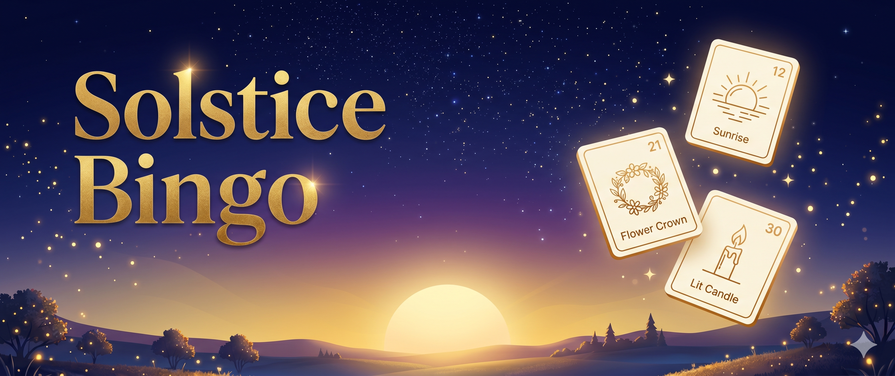

# Solstice Bingo ☀️

A browser-based bingo game built around small June rituals from around the world. Complete activities, mark them done, and watch the sky shift from deep night to solstice noon.

**[Play it here →](https://solstice-bingo.netlify.app/)**



## What it is

Each card draws 24 rituals at random from a pool of 33 June celebrations — Midsommar, Juneteenth, Bloomsday, Dragon Boat Festival, World Oceans Day, and many more. Tap any square to read about the celebration and what to do. Mark it done when you've done it in real life.

As you complete rituals, the sky gradually brightens from midnight to solstice noon. Finish a row, column, or diagonal for a Bingo. Light the whole card to bring the sun to its zenith.

## Features

- 33 rituals drawn from June celebrations around the world
- Each ritual has a short description, a suggested activity, and often a link to learn more
- Sky animation that rises with your progress (night → dawn → noon)
- Progress saved automatically in the browser — close the tab and come back later
- Shuffle for a fresh card at any time

## How to run locally

No build step needed. Just open `index.html` in a browser.

```bash
git clone <repo-url>
open index.html
```

## How it's built

Everything lives in a single `index.html` file — no frameworks, no bundlers, no dependencies. Plain HTML, CSS, and vanilla JavaScript.

A few things worth noting:

- **Sky animation** — CSS custom properties updated via a colour-interpolation function in JS. The sun literally rises as you play.
- **Progress** — saved in `localStorage` so it survives page reloads.
- **Card generation** — 24 rituals drawn at random from the pool on each new game, with one card (Alan Turing's birthday) always guaranteed to appear.

Built in collaboration with AI (Gemini + Claude) as a learning project — I'm still finding my way around CSS and JavaScript. It felt a lot like pair programming!

---

Made for the [June Solstice Game Jam](https://dev.to/challenges/june-game-jam-2026-06-03). Share your progress with **#solsticebingo** ☀️
